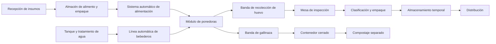
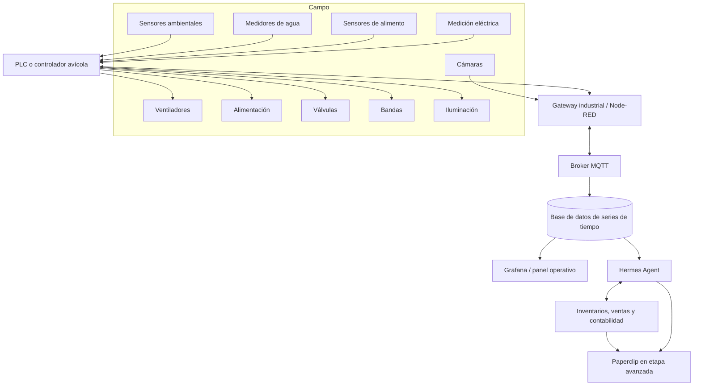

# NidoSmart

## Tecnología inteligente para producción avícola

**Eslogan principal:**

> Automatización que cuida, producción que crece.

# Plan de negocios

## Granja modular y automatizada de gallinas ponedoras en México

**Versión:** 1.0
**Fecha:** Julio de 2026
**Etapa inicial:** 100 gallinas ponedoras
**Escala de diseño inicial:** 300 aves
**Escala objetivo de largo plazo:** 5,000 aves

---

# 1. Resumen ejecutivo

El proyecto propone desarrollar una granja mexicana de gallinas ponedoras basada en tres principios:

1. **Inicio controlado:** comenzar con aproximadamente 100 gallinas para adquirir experiencia técnica, sanitaria, operativa y comercial sin asumir el riesgo de una explotación de miles de aves.
2. **Automatización intensiva:** automatizar más del 90% de las operaciones repetitivas, incluyendo alimentación, agua, iluminación, ventilación, control ambiental, recolección de huevo, retiro de gallinaza, monitoreo y generación de alertas.
3. **Crecimiento modular:** construir la infraestructura como una plataforma que pueda ampliarse por módulos independientes, evitando rediseñar completamente la granja cada vez que aumente el número de aves.

La recomendación es comenzar con **gallinas ponedoras y no con pollo de engorda**. Las ponedoras ofrecen flujo de ingresos diario, permiten validar gradualmente el canal comercial y tienen menores necesidades de procesamiento y sacrificio. También permiten corregir rápidamente problemas de precio, calidad, empaque, distribución y productividad.

El módulo inicial deberá alojar entre **96 y 120 aves**, pero los servicios compartidos —electricidad, agua, comunicaciones, control ambiental, almacenamiento, empaque y respaldo energético— deberán dimensionarse para aproximadamente **300 aves**. De esta manera, el segundo y tercer módulo podrán conectarse sin sustituir la infraestructura principal.

La estrategia comercial no debe basarse en competir con productores industriales mediante precio y volumen. A una escala pequeña, el negocio depende de:

* Venta directa.
* Entrega a domicilio.
* Suscripciones semanales.
* Restaurantes y pequeños negocios.
* Tiendas especializadas.
* Diferenciación por frescura, trazabilidad y producción local.

La inversión preliminar para un módulo automatizado de 100 aves se estima entre **$326,000 y $740,000 MXN**, sin considerar terreno. El rango depende principalmente del nivel de automatización, condiciones climáticas, obra civil, respaldo energético y origen de los equipos.

Una instalación altamente automatizada no tendrá una recuperación rápida si permanece indefinidamente en 100 gallinas. El primer módulo debe entenderse como una fase de validación que genera:

* Experiencia productiva.
* Información real de costos.
* Un canal comercial probado.
* Procedimientos operativos.
* Datos para ajustar la automatización.
* Infraestructura reutilizable para el crecimiento.

En la arquitectura digital, la recomendación es utilizar:

* **PLC o controlador avícola** para el control determinista y crítico.
* **Gateway industrial y Node-RED** para integrar sensores, equipos y comunicaciones.
* **Base de datos local de series de tiempo** para históricos de producción y ambiente.
* **Hermes Agent** como asistente inteligente local para análisis, alertas, documentación y operación asistida.
* **Paperclip** en una etapa posterior, cuando el negocio necesite coordinar varios agentes, módulos, áreas administrativas o ubicaciones.

---

# 2. Descripción del negocio

## 2.1 Concepto

El negocio producirá y comercializará huevo fresco para consumo humano mediante una granja tecnificada de pequeña escala que crecerá por módulos.

El sistema estará diseñado para:

* Reducir la mano de obra repetitiva.
* Mantener condiciones ambientales estables.
* Detectar anomalías anticipadamente.
* Registrar cada evento operativo.
* Mantener trazabilidad por lote.
* Facilitar la expansión de la capacidad.
* Mejorar progresivamente la eficiencia por ave.
* Integrar producción, ventas, inventarios y mantenimiento.

## 2.2 Producto inicial

El producto principal será:

* Huevo fresco de gallina.
* Clasificado por tamaño.
* Empacado en presentaciones de 12, 18 o 30 piezas.
* Comercializado dentro de un radio local.

Productos secundarios posibles:

* Gallinaza procesada o compostada.
* Gallinas de desecho al final del ciclo, respetando la regulación aplicable.
* Venta de datos, conocimiento o soluciones de automatización en una etapa avanzada.
* Consultoría o replicación del modelo modular para otros pequeños productores.

## 2.3 Propuesta de valor

La propuesta de valor será:

> Huevo fresco, local y trazable, producido mediante una granja automatizada que garantiza consistencia, monitoreo permanente y entregas recurrentes.

Los atributos diferenciadores serán:

* Frescura.
* Entrega frecuente.
* Trazabilidad del lote.
* Control sanitario documentado.
* Consistencia en tamaño y calidad.
* Disponibilidad mediante suscripción.
* Información transparente sobre producción.
* Uso responsable de tecnología.
* Capacidad de responder rápidamente ante problemas.

---

# 3. Justificación de la oportunidad

## 3.1 Mercado mexicano

México presenta una demanda profunda y estable de huevo. El consumo nacional se encuentra entre los más altos del mundo y el producto forma parte de la alimentación cotidiana de prácticamente todos los segmentos socioeconómicos.

El proyecto no necesita crear una nueva necesidad de consumo. El reto principal consiste en:

* Encontrar un microsegmento rentable.
* Vender sin depender del intermediario.
* Mantener continuidad de abastecimiento.
* Controlar el costo del alimento.
* Crear confianza en el producto.
* Evitar competir únicamente por precio.

## 3.2 Competencia

El mercado industrial está dominado por grandes empresas con:

* Producción masiva.
* Integración vertical.
* Marcas reconocidas.
* Distribución nacional.
* Economías de escala.
* Poder de negociación sobre alimento, transporte y empaque.

Una granja de 100 a 300 gallinas no puede competir eficientemente con estos operadores en centrales de abasto o mayoreo.

El posicionamiento correcto será:

* Productor local.
* Entregas de corta distancia.
* Producto fresco.
* Atención directa.
* Suscripción recurrente.
* Relación personal con clientes.
* Trazabilidad superior a la de un producto genérico.

## 3.3 Canales de oportunidad

Los canales prioritarios son:

1. Familias dentro de un radio de reparto reducido.
2. Restaurantes pequeños y medianos.
3. Panaderías y cafeterías.
4. Tiendas de productos locales.
5. Mercados de productores.
6. Gimnasios o comunidades interesadas en alimentación.
7. Condominios y grupos vecinales.
8. Suscripciones empresariales o familiares.

---

# 4. Selección del modelo productivo

## 4.1 Comparación entre ponedoras y pollo de engorda

| Criterio                          | Gallinas ponedoras              | Pollo de engorda                               |
| --------------------------------- | ------------------------------- | ---------------------------------------------- |
| Flujo de ingresos                 | Diario                          | Por lote                                       |
| Curva de aprendizaje              | Gradual                         | Concentrada y más sensible                     |
| Comercialización                  | Venta directa sencilla          | Requiere sacrificio y procesamiento            |
| Diferenciación                    | Frescura, tamaño y trazabilidad | Más limitada sin procesamiento especial        |
| Automatización                    | Altamente compatible            | También posible, pero más dependiente del lote |
| Riesgo comercial inicial          | Moderado                        | Mayor                                          |
| Necesidad de cadena sanitaria     | Menor                           | Mayor                                          |
| Posibilidad de suscripción        | Alta                            | Baja o periódica                               |
| Corrección de errores comerciales | Continua                        | Al cierre de cada ciclo                        |
| Recomendación inicial             | **Sí**                          | No como primera operación                      |

## 4.2 Decisión

Se recomienda comenzar con **gallinas ponedoras comerciales**, preferentemente adquiridas como pollitas de prepostura de aproximadamente 16 a 18 semanas.

Esta estrategia evita que el primer ciclo incluya simultáneamente:

* Crianza inicial.
* Manejo de temperatura de pollitas.
* Vacunación temprana.
* Desarrollo corporal.
* Transición a postura.
* Construcción del canal comercial.

La compra de pollitas de prepostura reduce el tiempo hasta los primeros ingresos y permite concentrarse en la operación de postura.

---

# 5. Objetivos del proyecto

## 5.1 Objetivo general

Construir una granja de gallinas ponedoras automatizada, rentable y modular que comience con 100 aves y pueda crecer progresivamente hasta 5,000 aves.

## 5.2 Objetivos específicos

* Automatizar al menos 90% de las tareas repetitivas.
* Validar un canal comercial antes de superar las 300 aves.
* Mantener registros digitales completos por lote.
* Minimizar mortalidad y pérdidas por estrés térmico.
* Monitorear alimento, agua, ambiente y postura diariamente.
* Mantener capacidad de operación local aun sin internet.
* Construir procedimientos estandarizados.
* Incorporar inteligencia artificial sin entregar a la IA el control crítico de las aves.
* Reinvertir parte del flujo operativo en módulos adicionales.
* Alcanzar una escala comercial de 1,000 aves antes de evaluar una segunda ubicación.

---

# 6. Modelo modular de crecimiento

## 6.1 Principio de modularidad

Cada módulo deberá funcionar como una unidad productiva parcialmente independiente, con:

* Alojamiento.
* Línea de agua.
* Distribución de alimento.
* Recolección de huevo.
* Retiro de gallinaza.
* Sensores ambientales.
* Tablero secundario.
* Identificación digital.
* Contadores de consumo.
* Capacidad de aislamiento sanitario.

Los servicios principales deberán compartirse:

* Área de almacenamiento.
* Silo o tolva principal.
* Tratamiento y almacenamiento de agua.
* Cuarto eléctrico.
* Servidor local.
* Área de clasificación y empaque.
* Respaldo energético.
* Zona de compostaje.
* Filtro sanitario.
* Sistema de comunicaciones.

## 6.2 Escala recomendada

| Etapa                 |    Capacidad | Objetivo                                            |
| --------------------- | -----------: | --------------------------------------------------- |
| Piloto                |     100 aves | Aprendizaje, automatización y validación comercial  |
| Validación            | 200–300 aves | Mejorar margen y aprovechar servicios compartidos   |
| Microgranja comercial |     500 aves | Formalizar rutas, inventario y mantenimiento        |
| Operación pequeña     |   1,000 aves | Incorporar personal y automatización administrativa |
| Operación mediana     |   2,500 aves | Separar áreas funcionales y aumentar redundancia    |
| Escala objetivo       |   5,000 aves | Operación profesional con gestión multiagente       |

## 6.3 Criterios para agregar un módulo

No deberá añadirse un nuevo módulo sólo porque exista espacio físico. La expansión se autorizará cuando se cumplan simultáneamente las siguientes condiciones:

* Venta recurrente de al menos 85% de la producción.
* Cartera diversificada de clientes.
* Mortalidad dentro del rango objetivo.
* Datos confiables de consumo.
* Flujo suficiente para financiar parte de la ampliación.
* Procedimientos sanitarios estables.
* Capacidad de almacenamiento y reparto.
* Ausencia de fallas críticas recurrentes.
* Canal comercial probado durante varios meses.

---

# 7. Diseño físico preliminar

## 7.1 Módulo inicial

Se propone una nave cerrada o semicerrada de aproximadamente **18 a 24 m²**, ajustable según:

* Clima.
* Sistema de alojamiento.
* Espacio de servicio.
* Flujo de personal.
* Equipos instalados.
* Requerimientos municipales.

El módulo deberá dividirse en subgrupos, por ejemplo:

* Cuatro grupos de 25 aves.
* Cinco grupos de 20 aves.
* Seis grupos de entre 16 y 18 aves.

Esto permite:

* Aislar problemas.
* Comparar desempeño.
* Realizar mantenimiento parcial.
* Identificar consumo por subgrupo.
* Facilitar futuras pruebas de alimentación o manejo.

## 7.2 Áreas generales del predio

El predio deberá considerar:

* Acceso controlado.
* Estacionamiento y recepción.
* Filtro sanitario.
* Cuarto técnico.
* Almacén de alimento.
* Área de empaque.
* Cámara o zona de almacenamiento temporal.
* Módulos de producción.
* Zona de gallinaza o compostaje.
* Área temporal para mortalidades.
* Vialidades internas.
* Espacio reservado para expansión.
* Barrera física y control de fauna.

## 7.3 Flujo operativo

---

# 8. Sistema de automatización

## 8.1 Procesos que deben automatizarse desde el inicio

### Alimentación

El sistema deberá incluir:

* Tolva o hopper.
* Línea de tornillo sinfín, cadena o mecanismo equivalente.
* Programación por horarios.
* Sensores de nivel.
* Medición del consumo del motor.
* Alarma por atasco o falta de alimento.
* Posibilidad de operación manual de emergencia.

### Agua

El sistema deberá incluir:

* Tanque de reserva.
* Filtrado.
* Regulador de presión.
* Medidor de caudal.
* Línea de bebederos tipo nipple.
* Sensor de nivel.
* Alarma por fuga.
* Alarma por ausencia de consumo.
* Válvula de corte.
* Punto de dosificación o medicación controlada.

### Iluminación

El sistema deberá permitir:

* Programación de fotoperiodo.
* Encendido y apagado gradual.
* Regulación de intensidad.
* Respaldo ante interrupciones eléctricas.
* Registro de horas efectivas de iluminación.
* Operación manual local.

### Control ambiental

Variables mínimas:

* Temperatura.
* Humedad relativa.
* Concentración de CO₂.
* Concentración de amoníaco.
* Estado de ventiladores.
* Flujo de aire cuando sea técnicamente viable.
* Consumo eléctrico.
* Estado de puertas.
* Presencia de humo o incendio.

Actuadores:

* Ventiladores.
* Entradas de aire.
* Extractores.
* Equipos de recirculación.
* Enfriamiento evaporativo cuando el clima lo requiera.
* Calefacción auxiliar cuando sea necesaria.
* Alarmas sonoras y remotas.

### Recolección de huevo

Para 100 aves se recomienda:

* Banda corta.
* Transporte hasta una mesa final.
* Sensor de operación.
* Conteo aproximado o cámara.
* Paro por obstrucción.
* Inspección y empaque manual.

No se recomienda comenzar con una clasificadora industrial de alta capacidad.

### Retiro de gallinaza

El módulo deberá integrar:

* Banda o sistema mecanizado.
* Operación programada.
* Sensor de motor.
* Contenedor cerrado.
* Traslado a zona separada de compostaje.
* Registro de cada retiro.

## 8.2 Procesos que pueden permanecer manuales inicialmente

* Inspección visual de las aves.
* Retiro de mortalidades.
* Clasificación final del huevo.
* Empaque.
* Limpieza profunda.
* Mantenimiento físico.
* Aplicación veterinaria.
* Control de visitantes.
* Revisión de plagas.
* Reposición de consumibles.

La automatización no elimina la necesidad de inspección diaria. Una granja con 90% de automatización aún requiere presencia humana para bienestar, sanidad y mantenimiento.

---

# 9. Arquitectura eléctrica, hidráulica y de comunicaciones

## 9.1 Sistema eléctrico

La instalación deberá contar con:

* Tablero eléctrico principal.
* Subtablero por módulo.
* Protección contra sobrecorriente.
* Protección contra descargas.
* Puesta a tierra.
* Medición energética por módulo.
* Circuitos separados para cargas críticas.
* Paros de emergencia.
* Contactores y relevadores industriales.
* Variadores para ventiladores cuando sea conveniente.
* UPS para controladores, comunicaciones y sensores.
* Generador o sistema de respaldo para cargas críticas.
* Posibilidad de integrar energía solar posteriormente.

Las cargas críticas son:

* Ventilación mínima.
* Agua.
* Controladores.
* Comunicaciones.
* Alarmas.
* Iluminación básica.

## 9.2 Sistema hidráulico

Se deberá instalar:

* Tanque pulmón.
* Bomba principal.
* Bomba o mecanismo de respaldo.
* Manifold con salida independiente para cada módulo.
* Medidor por módulo.
* Filtros.
* Reguladores.
* Válvulas de aislamiento.
* Puntos de muestreo.
* Drenajes y purgas.
* Sensor de presión.

## 9.3 Comunicaciones

La arquitectura recomendada es:

* Ethernet industrial como medio principal.
* Wi-Fi sólo para dispositivos no críticos.
* MQTT para telemetría.
* Modbus TCP o RTU para equipos industriales.
* Red separada para control.
* Red separada para administración e internet.
* VPN para acceso remoto.
* Grabación local de cámaras.
* Operación local durante fallas de internet.

---

# 10. Arquitectura tecnológica

## 10.1 Principio fundamental

El control crítico no debe depender de inteligencia artificial, servicios externos ni conexión a internet.

La jerarquía será:

1. Control físico y seguridad.
2. PLC o controlador avícola.
3. Gateway e integración.
4. Base de datos y visualización.
5. Agente inteligente.
6. Sistemas administrativos.

## 10.2 Arquitectura propuesta

## 10.3 Componentes de software posibles

* Node-RED.
* Mosquitto MQTT.
* PostgreSQL.
* TimescaleDB o InfluxDB.
* Grafana.
* Home Assistant para elementos auxiliares no críticos.
* MinIO o almacenamiento equivalente para documentos.
* ERPNext, Odoo u otro ERP ligero.
* Hermes Agent.
* Paperclip en fases posteriores.

---

# 11. Evaluación técnica de Hermes Agent y Paperclip

## 11.1 Hermes Agent

Hermes Agent es más apropiado como asistente inteligente local de la granja.

Funciones potenciales:

* Consultar métricas.
* Analizar históricos.
* Resumir la jornada.
* Detectar desviaciones.
* Generar órdenes de trabajo.
* Consultar manuales y procedimientos.
* Ejecutar tareas programadas.
* Crear reportes.
* Interactuar mediante lenguaje natural.
* Operar con modelos locales o servicios externos.
* Integrarse con herramientas mediante MCP y APIs.

Ventajas:

* Despliegue self-hosted.
* Posibilidad de operación local.
* Memoria persistente.
* Uso de skills.
* Tareas recurrentes.
* Integración con herramientas.
* Aislamiento y aprobación de comandos.
* Adecuado para un único sitio o una operación pequeña.

Limitaciones:

* No sustituye a un PLC.
* Requiere desarrollo de conectores.
* Necesita políticas estrictas de autorización.
* Su madurez debe verificarse antes de confiarle procesos críticos.
* El desempeño depende del modelo utilizado.

## 11.2 Paperclip

Paperclip es más apropiado como capa de gobierno y coordinación empresarial.

Funciones potenciales:

* Coordinar varios agentes.
* Asignar objetivos.
* Controlar presupuestos.
* Auditar tareas.
* Gestionar conversaciones.
* Mantener sesiones.
* Administrar varias áreas o empresas.
* Coordinar ventas, compras, marketing y administración.

Ventajas:

* Orientación multiagente.
* Gobernanza.
* Presupuestos.
* Auditoría.
* Coordinación de áreas.
* Utilidad creciente al aumentar la complejidad del negocio.

Limitaciones:

* Es excesivo para una granja inicial de 100 aves.
* No está diseñado como controlador industrial.
* No debe actuar directamente sobre equipos críticos.
* Su valor aparece principalmente cuando existen varios agentes, áreas o ubicaciones.

## 11.3 Comparación

| Criterio                     | Hermes Agent        | Paperclip                         |
| ---------------------------- | ------------------- | --------------------------------- |
| Operación local en la granja | Alta adecuación     | Adecuación limitada               |
| Asistente operativo          | Alta                | Media                             |
| Gestión multiagente          | Media               | Alta                              |
| Control industrial directo   | No recomendado      | No recomendado                    |
| Integración documental       | Alta                | Alta                              |
| Tareas programadas           | Alta                | Alta                              |
| Gobierno y auditoría         | Media               | Alta                              |
| Uso en 100 aves              | Recomendado         | Prematuro                         |
| Uso en 5,000 aves            | Recomendado en edge | Recomendado como capa empresarial |
| Prioridad                    | Primera etapa       | Etapa posterior                   |

## 11.4 Decisión tecnológica

La arquitectura elegida será:

* **Hermes Agent como núcleo de inteligencia operativa.**
* **Paperclip como sistema futuro de coordinación empresarial.**

Paperclip se incorporará cuando existan:

* Varias naves.
* Múltiples responsables.
* Más de una ubicación.
* Agentes especializados.
* Presupuestos por área.
* Procesos administrativos complejos.
* Necesidad formal de auditoría multiagente.

---

# 12. Funciones del agente inteligente

Hermes Agent podrá actuar como asistente de operación y negocio.

## 12.1 Supervisión productiva

* Consultar postura diaria.
* Comparar producción real contra curva esperada.
* Calcular porcentaje de postura.
* Detectar desviaciones por lote.
* Analizar huevo roto o sucio.
* Relacionar producción con temperatura, agua y alimento.

## 12.2 Monitoreo ambiental

* Resumir temperatura y humedad.
* Detectar periodos fuera de rango.
* Correlacionar estrés térmico y caída de producción.
* Generar alertas.
* Recomendar revisión de equipos.
* Preparar reportes semanales.

## 12.3 Inventario y compras

* Calcular días restantes de alimento.
* Estimar demanda de empaque.
* Generar borradores de órdenes de compra.
* Comparar proveedores.
* Detectar variaciones de precio.
* Alertar sobre inventarios mínimos.

## 12.4 Mantenimiento

* Registrar horas de funcionamiento.
* Programar mantenimiento preventivo.
* Crear órdenes de trabajo.
* Consultar manuales.
* Mantener historial por equipo.
* Detectar incremento anormal de consumo eléctrico.
* Alertar sobre motores o bombas con comportamiento irregular.

## 12.5 Comercialización

* Registrar ventas.
* Analizar clientes recurrentes.
* Preparar rutas de reparto.
* Calcular demanda por presentación.
* Identificar riesgo de sobreproducción.
* Preparar mensajes de confirmación.
* Generar reportes de cobranza.
* Estimar producción disponible para nuevos clientes.

## 12.6 Gestión documental

* Consultar procedimientos operativos.
* Almacenar bitácoras.
* Gestionar registros sanitarios.
* Recuperar manuales.
* Preparar evidencia para auditorías.
* Generar reportes de trazabilidad.
* Mantener versiones de procedimientos.

---

# 13. Seguridad funcional y ciberseguridad

## 13.1 Regla de acceso

La política será:

> Lectura amplia y escritura restringida.

El agente podrá consultar casi todas las variables, pero sólo podrá ejecutar acciones dentro de límites predefinidos.

## 13.2 Acciones permitidas

* Crear alertas.
* Generar reportes.
* Abrir órdenes de mantenimiento.
* Consultar inventario.
* Preparar órdenes de compra.
* Activar pruebas de equipos no críticos.
* Cambiar parámetros dentro de bandas autorizadas.
* Solicitar aprobación humana.

## 13.3 Acciones restringidas

No deberá modificar libremente:

* Ventilación mínima.
* Disponibilidad de agua.
* Fotoperiodo.
* Dosificación veterinaria.
* Protecciones eléctricas.
* Parámetros de seguridad.
* Alarmas críticas.
* Límites de temperatura.
* Actuadores durante una emergencia.

## 13.4 Controles requeridos

* Segmentación de red.
* VPN.
* Autenticación.
* Roles.
* Listas blancas de comandos.
* Registro de acciones.
* Aprobación humana.
* Copias de seguridad.
* Operación manual.
* PLC como autoridad final.
* Paros de emergencia físicos.
* Pruebas periódicas de recuperación.

---

# 14. Modelo operativo

## 14.1 Rutina diaria

Aunque la mayor parte de la granja esté automatizada, deberá realizarse una inspección diaria.

Actividades:

* Recorrido visual.
* Revisión de comportamiento.
* Inspección de mortalidad.
* Revisión de agua.
* Revisión de alimento.
* Verificación de ventilación.
* Inspección de huevo.
* Limpieza del área de empaque.
* Confirmación de alarmas.
* Registro de incidencias.

## 14.2 Rutina semanal

* Calibración visual de sensores.
* Limpieza de filtros.
* Revisión de motores.
* Análisis de producción.
* Verificación de inventarios.
* Limpieza de líneas.
* Revisión de plagas.
* Respaldo de información.
* Evaluación comercial.

## 14.3 Rutina mensual

* Mantenimiento preventivo.
* Análisis financiero.
* Revisión veterinaria.
* Evaluación de bioseguridad.
* Comparación contra metas.
* Prueba de energía de respaldo.
* Revisión de procedimientos.
* Auditoría de accesos digitales.
* Planificación de compras.

---

# 15. Estrategia comercial

## 15.1 Posicionamiento

La marca deberá posicionarse como:

* Local.
* Fresca.
* Confiable.
* Trazable.
* Tecnificada.
* Cercana al consumidor.

No debe prometer atributos como “orgánico”, “libre pastoreo” o “cage-free” salvo que el sistema realmente cumpla con los requisitos correspondientes.

## 15.2 Modelo de venta

El modelo recomendado es una combinación de:

* Suscripciones familiares.
* Venta directa.
* Restaurantes.
* Panaderías.
* Tiendas locales.
* Venta de excedentes.

## 15.3 Suscripciones

Ejemplos:

| Plan              | Entrega                                 |
| ----------------- | --------------------------------------- |
| Familiar básico   | 12 huevos por semana                    |
| Familiar estándar | 18 huevos por semana                    |
| Familiar grande   | 30 huevos por semana                    |
| Negocio pequeño   | 60–120 huevos por semana                |
| Restaurante       | Volumen acordado con entrega programada |

## 15.4 Política de precios

El precio deberá cubrir:

* Alimento.
* Reposición.
* Empaque.
* Distribución.
* Energía.
* Mortalidad.
* Mantenimiento.
* Mano de obra.
* Depreciación.
* Reserva sanitaria.
* Margen.

No debe utilizarse el precio mayorista como referencia única. El valor del proyecto depende de capturar una prima por venta directa.

---

# 16. Producción y capacidad comercial

Un lote de 100 aves no producirá 100 huevos diarios durante todo el ciclo.

Como estimación operativa deberá utilizarse una curva que considere:

* Periodo inicial de incremento.
* Pico de producción.
* Descenso gradual.
* Mortalidad.
* Huevo roto.
* Huevo descartado.
* Variación estacional.

Un escenario de aproximadamente **30,000 a 31,000 huevos comercializables por año** para el primer módulo puede emplearse como base preliminar, sujeto a la línea genética, manejo y duración del ciclo.

La producción promedio podría equivaler aproximadamente a:

* 2,500 huevos mensuales.
* 580 huevos semanales.
* 80 a 85 huevos diarios en promedio anual.

Esto representa aproximadamente:

* 48 paquetes de 12 huevos por semana.
* 32 paquetes de 18 huevos por semana.
* 19 paquetes de 30 huevos por semana.

La cartera comercial inicial debe construirse antes de que las aves alcancen su máxima postura.

---

# 17. Plan financiero preliminar

## 17.1 Inversión inicial

| Concepto                                    |    Rango estimado MXN |
| ------------------------------------------- | --------------------: |
| Obra civil ligera, firme, drenaje y cercado |      $70,000–$130,000 |
| Alojamiento modular                         |      $60,000–$120,000 |
| Alimentación automática                     |       $18,000–$40,000 |
| Agua, filtrado y medición                   |       $15,000–$30,000 |
| Ventilación y control térmico               |       $45,000–$95,000 |
| Controlador, sensores y comunicaciones      |       $25,000–$65,000 |
| Recolección automática de huevo             |       $20,000–$55,000 |
| Retiro de gallinaza                         |       $18,000–$40,000 |
| UPS y respaldo energético                   |      $35,000–$110,000 |
| Bioseguridad y contingencias                |       $20,000–$55,000 |
| **Total estimado**                          | **$326,000–$740,000** |

No se incluyen:

* Terreno.
* Vehículo.
* Financiamiento.
* Impuestos.
* Permisos locales.
* Estudios ambientales.
* Obra mayor.
* Conexión eléctrica especial.
* Pozo.
* Mano de obra permanente.

## 17.2 Supuestos preliminares

Para el escenario base:

* Precio promedio: $4.20 por huevo.
* Producción comercializable año 1: 30,660 huevos.
* Consumo: 110–120 gramos de alimento por ave al día.
* Precio preliminar del alimento: $14.80 por kilogramo.
* Venta directa o semidirecta.
* Expansión anual de 100 aves durante los primeros tres años.

## 17.3 Proyección preliminar

| Año | Módulos | Huevos vendidos | Ingresos |     OPEX | Flujo antes de expansión | CAPEX de expansión | Flujo neto |
| --- | ------: | --------------: | -------: | -------: | -----------------------: | -----------------: | ---------: |
| 1   |       1 |          30,660 | $128,772 | $122,762 |                   $6,010 |                 $0 |     $6,010 |
| 2   |       2 |          59,130 | $248,346 | $212,211 |                  $36,135 |           $110,000 |   -$73,865 |
| 3   |       3 |          85,410 | $358,722 | $302,346 |                  $56,376 |           $110,000 |   -$53,624 |

Estas cifras son un ejercicio preliminar, no una cotización ni una garantía de rentabilidad.

## 17.4 Interpretación

El módulo de 100 aves puede sostener buena parte de su operación, pero no recuperará rápidamente una instalación industrial sobredimensionada.

La inversión mejora cuando:

* Los servicios compartidos atienden varios módulos.
* Aumenta la utilización de equipos.
* Se vende directamente.
* Se reduce el costo de alimento.
* Se optimizan rutas.
* Se disminuye la mano de obra por ave.
* Se mantiene alta productividad.
* La infraestructura inicial no tiene que reemplazarse.

## 17.5 Punto estratégico

Antes de invertir deberá prepararse un modelo financiero con tres escenarios:

### Conservador

* Menor postura.
* Precio de venta bajo.
* Alimento caro.
* Mayor mortalidad.
* Pérdidas comerciales.
* Crecimiento detenido.

### Base

* Productividad cercana a la guía genética.
* Venta directa estable.
* Costos controlados.
* Expansión gradual.

### Optimista

* Precio premium.
* Suscripciones completas.
* Mortalidad baja.
* Alto aprovechamiento de equipos.
* Venta de gallinaza.
* Crecimiento acelerado.

---

# 18. Regulación y cumplimiento

La operación deberá validar, según su ubicación:

* Registro de la unidad de producción ante SENASICA.
* Uso de suelo.
* Licencia de construcción.
* Permisos municipales.
* Regulación ambiental.
* Manejo de residuos.
* Aprovechamiento o descarga de agua.
* Requisitos de movilización.
* Condiciones sanitarias del huevo.
* Etiquetado y empaque.
* Obligaciones fiscales.
* Condiciones laborales.

Referencias principales:

* Ley Federal de Sanidad Animal.
* Manual de Buenas Prácticas Pecuarias para producción de huevo para plato.
* NOM-159-SSA1-2016.
* NMX-FF-127-SCFI-2016.
* Disposiciones de SENASICA.
* Requisitos estatales y municipales.
* Reglas de CONAGUA cuando se utilicen aguas nacionales.

La ubicación definitiva deberá elegirse sólo después de confirmar la viabilidad regulatoria del predio.

---

# 19. Bioseguridad

La bioseguridad es un componente central del negocio.

## 19.1 Medidas mínimas

* Perímetro controlado.
* Entrada única.
* Registro de visitantes.
* Ropa exclusiva.
* Calzado exclusivo.
* Lavado y desinfección.
* Control de roedores.
* Control de aves silvestres.
* Restricción de vehículos.
* Limpieza programada.
* Manejo separado de gallinaza.
* Manejo seguro de mortalidades.
* Plan veterinario.
* Programa de vacunación.
* Registros sanitarios.
* Almacenamiento protegido de alimento.

## 19.2 Respuesta ante anomalías

El sistema deberá alertar cuando exista:

* Caída de consumo de agua.
* Caída de consumo de alimento.
* Aumento de mortalidad.
* Disminución repentina de postura.
* Temperatura fuera de rango.
* Amoníaco alto.
* Falla de ventilación.
* Pérdida de energía.
* Fuga de agua.
* Comportamiento anormal detectado por cámaras o inspección.

---

# 20. Gestión de riesgos

| Riesgo                    | Impacto                            | Mitigación                               |
| ------------------------- | ---------------------------------- | ---------------------------------------- |
| Enfermedades              | Mortalidad y pérdida de producción | Bioseguridad, vacunación y monitoreo     |
| Influenza aviar           | Cierre o sacrificio sanitario      | Registro, vigilancia y control de acceso |
| Estrés térmico            | Caída de postura y mortalidad      | Ventilación, respaldo y alarmas          |
| Alimento caro             | Reducción del margen               | Varios proveedores y compras programadas |
| Baja demanda              | Sobreinventario                    | Suscripciones y clientes ancla           |
| Dependencia de un cliente | Riesgo de caja                     | Diversificación                          |
| Falla de agua             | Emergencia inmediata               | Tanque, alarmas y redundancia            |
| Falla eléctrica           | Riesgo ambiental                   | UPS y generador                          |
| Falla de automatización   | Interrupción operativa             | Modo manual y refacciones                |
| Sobreautomatización       | Retorno demasiado largo            | Implementación por etapas                |
| Error del agente de IA    | Acción incorrecta                  | Accesos limitados y aprobación humana    |
| Robo o vandalismo         | Pérdida de activos                 | Cercado, cámaras y seguros               |
| Crecimiento prematuro     | Falta de mercado                   | Expansión condicionada a ventas          |
| Mala selección del predio | Costos regulatorios                | Prefactibilidad antes de comprar         |

---

# 21. Hoja de ruta

## Fase 0. Prefactibilidad

Duración orientativa: 1 a 3 meses.

Actividades:

* Definir ubicación.
* Investigar uso de suelo.
* Cotizar agua y electricidad.
* Analizar mercado local.
* Entrevistar clientes.
* Identificar proveedores.
* Solicitar cotizaciones.
* Preparar modelo financiero.
* Definir sistema de alojamiento.
* Consultar veterinario avícola.
* Diseñar layout maestro.

Resultado requerido:

* Decisión de inversión sustentada.
* Predio viable.
* Presupuesto.
* Lista preliminar de clientes.
* Arquitectura definida.

## Fase 1. Infraestructura base

Capacidad: 100 aves, servicios dimensionados para 300.

Instalar:

* Módulo de alojamiento.
* Agua automática.
* Alimentación automática.
* Ventilación.
* Iluminación.
* Sensores.
* Controlador.
* Respaldo.
* Bioseguridad.
* Gateway.
* Base de datos.
* Panel operativo.

## Fase 2. Validación productiva y comercial

Duración: primer ciclo.

Objetivos:

* Medir producción real.
* Ajustar alimentación.
* Detectar fallas.
* Validar precios.
* Crear suscripciones.
* Documentar procedimientos.
* Comparar costos reales.
* Ajustar automatización.

## Fase 3. Expansión a 200–300 aves

Condición:

* Al menos 85% de la producción comprometida.
* Operación estable.
* Flujo suficiente.
* Infraestructura sin fallas críticas.

Incorporar:

* Segundo y tercer módulo.
* Mayor tolva.
* Mejor almacenamiento.
* Automatización de reparto.
* Inventario digital.
* Hermes Agent.
* Mantenimiento preventivo automatizado.

## Fase 4. Expansión a 500–1,000 aves

Incorporar:

* Personal operativo.
* Clasificación más eficiente.
* ERP formal.
* Cámaras con análisis.
* Redundancia eléctrica e hidráulica.
* Vehículo de reparto.
* Almacén ampliado.
* Indicadores financieros por módulo.
* Agentes especializados.

## Fase 5. Expansión a 2,500–5,000 aves

Incorporar:

* Varias naves.
* Separación de lotes.
* Automatización de empaque.
* Paperclip.
* Agentes de ventas, compras, mantenimiento y finanzas.
* Presupuestos por área.
* Auditoría.
* Centro de operaciones.
* Posible segunda ubicación.
* Contratos comerciales de mayor volumen.

---

# 22. Indicadores clave

## 22.1 Productivos

* Porcentaje diario de postura.
* Huevos por gallina alojada.
* Huevos comercializables.
* Huevo roto.
* Huevo sucio.
* Peso promedio.
* Mortalidad.
* Consumo de alimento por ave.
* Consumo de agua por ave.
* Conversión alimenticia por kilogramo de huevo.

## 22.2 Ambientales

* Temperatura promedio.
* Horas fuera de rango.
* Humedad.
* CO₂.
* Amoníaco.
* Tiempo de ventilación.
* Consumo eléctrico.
* Número de alarmas.

## 22.3 Comerciales

* Precio promedio por huevo.
* Porcentaje de producción vendida.
* Clientes recurrentes.
* Cancelaciones.
* Ventas por canal.
* Costo de reparto.
* Ingreso por cliente.
* Días de inventario.

## 22.4 Financieros

* Margen bruto.
* Margen operativo.
* Costo por huevo.
* Costo de alimento por huevo.
* Flujo de caja.
* CAPEX por ave.
* Periodo de recuperación.
* Reserva sanitaria.
* Nivel de endeudamiento.

## 22.5 Técnicos

* Disponibilidad del sistema.
* Horas de falla.
* Alarmas falsas.
* Mantenimiento pendiente.
* Consumo energético por módulo.
* Tiempo medio de reparación.
* Número de operaciones manuales de emergencia.

---

# 23. Organización inicial

Durante la etapa de 100 aves, el negocio puede operar con una estructura ligera.

## Dirección

Responsabilidades:

* Estrategia.
* Finanzas.
* Expansión.
* Proveedores.
* Tecnología.
* Clientes principales.

## Operación

Responsabilidades:

* Inspección.
* Clasificación.
* Empaque.
* Limpieza.
* Mantenimiento básico.
* Registro de incidencias.

## Veterinario externo

Responsabilidades:

* Programa sanitario.
* Vacunación.
* Diagnóstico.
* Bioseguridad.
* Manejo de medicamentos.
* Capacitación.

## Soporte técnico

Responsabilidades:

* PLC.
* Sensores.
* Redes.
* Respaldos.
* Automatización.
* Ciberseguridad.

A medida que la granja crezca deberán separarse:

* Producción.
* Mantenimiento.
* Ventas.
* Distribución.
* Administración.
* Sanidad.
* Tecnología.

---

# 24. Estrategia de inversión

## 24.1 Elementos que no deben sacrificarse

* Agua confiable.
* Ventilación.
* Controlador.
* Sensores básicos.
* Alarmas.
* Respaldo energético.
* Bioseguridad.
* Operación manual de emergencia.
* Diseño modular.
* Capacidad de registrar datos.

## 24.2 Elementos que pueden aplazarse

* Clasificador industrial.
* Empacadora automática.
* Robots.
* Visión artificial avanzada.
* Paperclip.
* ERP complejo.
* Energía solar total.
* Automatización completa de distribución.
* Sistemas de alta capacidad diseñados para miles de aves.

## 24.3 Estrategia recomendada

La automatización debe priorizar los procesos donde una falla puede matar aves o reducir inmediatamente la producción:

1. Agua.
2. Ventilación.
3. Alarmas.
4. Energía de respaldo.
5. Alimentación.
6. Iluminación.
7. Monitoreo.
8. Gallinaza.
9. Recolección.
10. Empaque.

---

# 25. Factores críticos de éxito

El proyecto tendrá mejores probabilidades de éxito cuando:

* El predio tenga agua y energía confiables.
* Se adquieran aves de buena genética.
* El primer lote sea de prepostura.
* Exista acompañamiento veterinario.
* El canal comercial se construya antes del pico.
* La infraestructura se diseñe para crecer.
* La automatización tenga modo manual.
* Los equipos tengan refacciones.
* Se registren datos desde el primer día.
* No se dependa del mayoreo.
* Se mantenga disciplina de bioseguridad.
* La expansión dependa de indicadores.
* La IA actúe como asistente y no como controlador crítico.

---

# 26. Decisión recomendada

Se recomienda continuar con el proyecto bajo las siguientes condiciones:

1. Comenzar con **100 gallinas ponedoras de prepostura**.
2. Construir un primer módulo automatizado de entre 96 y 120 plazas.
3. Dimensionar los servicios principales para aproximadamente 300 aves.
4. Priorizar venta directa y suscripciones.
5. Automatizar agua, alimentación, ambiente, iluminación, alertas y registros desde el inicio.
6. Utilizar una banda corta para recolección de huevo.
7. Mantener clasificación y empaque manual en la primera etapa.
8. Utilizar PLC o controlador avícola como núcleo de control.
9. Incorporar Node-RED, MQTT y una base de datos local.
10. Integrar Hermes Agent una vez que el sistema produzca datos confiables.
11. Incorporar Paperclip sólo cuando existan varios módulos, agentes o áreas administrativas.
12. No ampliar la capacidad hasta validar la venta recurrente de la producción actual.

---

# 27. Próximos pasos

1. Seleccionar estado y municipio.
2. Definir si se cuenta con terreno propio, arrendado o por adquirir.
3. Confirmar agua, electricidad y conectividad.
4. Verificar uso de suelo y restricciones sanitarias.
5. Solicitar al menos tres cotizaciones de alojamiento.
6. Cotizar control ambiental y respaldo eléctrico.
7. Consultar a un veterinario avícola.
8. Identificar proveedores de pollitas.
9. Levantar una encuesta comercial local.
10. Conseguir clientes piloto.
11. Preparar el modelo financiero detallado.
12. Diseñar el layout para 300, 1,000 y 5,000 aves.
13. Crear los primeros procedimientos de bioseguridad.
14. Definir la arquitectura de automatización.
15. Construir un prototipo de tablero y sensado antes de recibir las aves.

---

# 28. Fuentes técnicas de referencia

Las principales instituciones, documentos y fabricantes considerados en la investigación incluyen:

* Servicio Nacional de Sanidad, Inocuidad y Calidad Agroalimentaria.
* Secretaría de Agricultura y Desarrollo Rural.
* Sistema Nacional de Información e Integración de Mercados.
* Unión Nacional de Avicultores.
* Fideicomisos Instituidos en Relación con la Agricultura.
* Universidad Nacional Autónoma de México.
* Instituto Nacional de Investigaciones Forestales, Agrícolas y Pecuarias.
* Hy-Line International.
* Lohmann Breeders.
* Munters y Rotem.
* Big Dutchman.
* Vencomatic Group.
* LUBING.
* PLASSON.
* Purina México.
* Hermes Agent, de Nous Research.
* Paperclip.

---

# 29. Conclusión

El proyecto de 100 ponedoras es adecuado como punto de entrada, siempre que no se evalúe como una unidad aislada que debe pagar inmediatamente toda la automatización.

Su verdadero valor consiste en funcionar como el primer módulo de una plataforma productiva mayor. El módulo inicial permitirá aprender, reunir datos, construir una cartera de clientes, ajustar la automatización y establecer una operación sanitaria disciplinada.

La decisión estratégica correcta es:

> Comenzar pequeño en número de aves, pero diseñar profesionalmente la infraestructura, los datos, los controles y el crecimiento.

La ventaja competitiva no será producir más barato que las grandes empresas, sino operar con frescura, trazabilidad, cercanía, consistencia y una estructura tecnológica que permita crecer sin perder el control.

