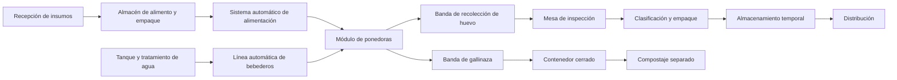

# Diseño físico preliminar

## 7.1 Módulo inicial

**Actualización (septiembre 2026):** el módulo inicial queda congelado como una **primera unidad financiable de 640 aves**. Esto no es una estimación propia: la cotización del proveedor (FamTECH — ver [registro de cotizaciones](../../evidence/quotations/README.md)) especifica textualmente "Advised chicken coop size: 17m×4m×4.2m / Total number: 640 birds" — nave de **17 × 4 × 4.2 m** (≈68 m² de huella), con jaula automatizada tipo H de **4 niveles, 5 sets** de **128 aves cada uno** (equivalencia "1 set = 1 grupo de jaula = 128 aves" confirmada por el proveedor por escrito el 2026-07-23). Esto sustituye la referencia anterior de una nave genérica de 18–24 m² con alojamiento en piso o jaula sin especificar, que correspondía a un sistema de menor densidad y ya no es una referencia válida una vez que existe una cotización real.

La subdivisión en subgrupos ya no es una decisión de diseño abierta: queda definida por la propia jaula tipo H (5 sets independientes, 4 niveles cada uno), lo que de forma natural permite:

* Aislar problemas.
* Comparar desempeño.
* Realizar mantenimiento parcial.
* Identificar consumo por subgrupo.
* Facilitar futuras pruebas de alimentación o manejo.

### Condiciones climáticas del sitio

El predio en San Francisco Acatepec se ubica en el altiplano poblano, a una altitud aproximada de 2,150 metros sobre el nivel del mar, con clima templado subhúmedo, temperaturas moderadas la mayor parte del año, noches frescas y una temporada de lluvias en verano que puede incluir granizadas. Estas condiciones deberán considerarse en el diseño:

* Menor riesgo de estrés calórico que en climas cálidos, lo que reduce la dependencia de enfriamiento evaporativo intensivo.
* Necesidad de protección contra descensos nocturnos de temperatura y heladas, particularmente en invierno.
* Estructura y techumbre resistentes a granizo.
* Buen drenaje pluvial durante la temporada de lluvias.
* Posible necesidad de calefacción auxiliar puntual, en lugar de un sistema de enfriamiento como prioridad principal.

**Nota técnica (revisión julio 2026):** la literatura de la industria (Bell & Weaver, *Commercial Chicken Meat and Egg Production*) no utiliza calefacción suplementaria para gallinas ponedoras adultas — ese recurso se reserva para la crianza de pollitas. Para clima frío en aves adultas, la estrategia estándar es **aislamiento térmico de la nave** combinado con **ventilación mínima reducida** (hasta 0.5 cfm/ave si existe sistema de enfriamiento tipo túnel para el verano), aprovechando el calor metabólico propio de las aves (~40–45 BTU/hora/ave). En consecuencia, la calefacción auxiliar debe tratarse como **contingencia secundaria para eventos extremos**, y la prioridad de diseño debe recaer en la especificación de aislamiento térmico de techo y paredes y en el control de ventilación mínima.

**Revisión septiembre 2026 — validación de R-20/R-14 (confirmado: se mantiene):** se revisaron íntegramente los tres libros de referencia del proyecto (*Commercial Chicken Meat and Egg Production*, *Poultry Production in Hot Climates*, y la guía de manejo Hy-Line W-80) más fuentes externas actuales para validar si R-20 techo / R-14 paredes sigue siendo apropiado.

*Fuente original de los valores (confirmado — Bell & Weaver, cap. 8, pp.154-157):*

| Tipo de clima | Δt (interior − exterior) | R techo (IP) | R paredes (IP) |
|---|---|---|---|
| Cálido | <30°F (17°C) | 9 | 6 |
| Medio | 30–50°F (17–28°C) | 12 | 8 |
| Frío | >50°F (28°C) | **20** | **14** |

*Cálculo de Δt para San Francisco Acatepec (recomendación técnica — no hay estación meteorológica propia en el predio, dato pendiente):* usando la temperatura interior objetivo de la línea genética Hy-Line W-80 en postura (**21°C**, guía de manejo p.9) y temperaturas exteriores regionales (Puebla/San Andrés Cholula, 2,150 msnm: mínima promedio de enero ≈7°C, heladas ocasionales hasta 0°C, extremos rurales estimados de -2 a -3°C), el Δt resultante (14–24°C) ubica al predio en la categoría **Media** de Bell & Weaver (17–28°C), no en "Frío" — lo que por sí solo apuntaría a R-12 techo / R-8 paredes como mínimo técnico.

*Por qué se mantiene R-20/R-14 de todos modos (decisión de diseño, margen de seguridad):* tres fuentes convergen en valores iguales o superiores a R-20/R-14 para naves de ponedoras sin calefacción suplementaria:
- **MWPS-7** (estándar ganadero de clima frío): R-19 techo / R-11 paredes como mínimo.
- **Estudio reciente revisado por pares** (nave multi-nivel de ponedoras, ventilación lateral, sin calefacción suplementaria) que logró 18.3–24.3°C interior en invierno (promedio 21.2°C, igual al objetivo Hy-Line) usando lana mineral de 150 mm en paredes (≈R-21 IP) y 200 mm en techo (≈R-28 IP) — más aislamiento que R-20/R-14, no menos.
- El propio Bell & Weaver, aplicado con el Δt calculado, da un mínimo (R-12/R-8) que ningún caso real revisado usa en la práctica para este tipo de sistema.

Dado que el costo incremental de aislar de más es bajo frente al riesgo de sub-aislar en un sitio a 2,150 msnm sin dato de estación propia, **R-20 techo / R-14 paredes se mantiene como valor de diseño**, ahora documentado como margen de seguridad validado por tres fuentes independientes, no como una estimación sin verificar.

*Aislamiento mínimo vs. recomendado (unidades IP y SI, 1 m²·°C/W = 5.678 ft²·°F·h/Btu):*

| | R (IP) | R (SI, m²·°C/W) | Base |
|---|---|---|---|
| Techo — mínimo por Δt regional | R-12 | 2.11 | Bell & Weaver, categoría Media |
| **Techo — recomendado (mantener)** | **R-20** | **3.52** | Bell & Weaver "Frío" + MWPS-7 + estudio reciente |
| Pared — mínimo por Δt regional | R-8 | 1.41 | Bell & Weaver, categoría Media |
| **Pared — recomendada (mantener)** | **R-14** | **2.46** | Bell & Weaver "Frío" + MWPS-7 + estudio reciente |

*Materiales y espesores aproximados (recomendación técnica, Bell & Weaver tabla 8-4):*

| Material | R por pulgada | Espesor para R-20 (techo) | Espesor para R-14 (pared) |
|---|---|---|---|
| Lana mineral / fibra de vidrio | R-3.3–3.7/in | ~13.5–15 cm | ~9.5–10.5 cm |
| Poliestireno expandido (EPS) | R-3.5/in | ~14.5 cm | ~10 cm |
| Poliestireno extruido (XPS) | R-5.0/in | ~10 cm | ~7 cm |
| Poliuretano rígido | R-6.6/in | ~7.5 cm | ~5.5 cm |

**Nuevo requisito — barrera de vapor (Bell & Weaver, cap. 8, p.155):** el aislante debe llevar barrera de vapor del lado interior/caliente (perm <0.5 — lámina de aluminio o polietileno), independientemente del valor R elegido. Con 640 aves produciendo ~7–8 kg/h de vapor de agua en clima frío (Tabla 8-2, escalada de la fuente), omitir la barrera de vapor puede condensar humedad dentro del aislamiento, perdiendo su valor R y corroyendo la estructura. Este requisito no estaba documentado antes y aplica sin importar el nivel de aislamiento final.

**Pendiente:** confirmar con datos reales (estación CONAGUA más cercana o registro propio de al menos un invierno en el predio) la temperatura mínima de diseño exacta del sitio — no para decidir si aislar (R-20/R-14 ya se mantiene), sino para el cálculo fino de carga térmica (Btu/h) y dimensionamiento de ventilación mínima de invierno en el proyecto ejecutivo final de obra civil. Sigue pendiente también solicitar al proveedor de la nave/jaula la especificación de aislamiento (valor R o equivalente) de su construcción propuesta, para verificar que cumple o supera estos valores.

### 7.1.1 Layout funcional recomendado (dentro de la nave 17×4×4.2 m)

**Revisión septiembre 2026:** se revisó la cotización FamTECH completa (partida por partida) y el hilo de correo íntegro con el proveedor para verificar si contenían datos de layout no reflejados aún en este documento. La cotización confirma que el sistema tiene equipo de cabecera en **ambos extremos** de la nave — "Front-end components" (hopper y motorreductor del skip-hoist feeder) y "Backend components and driver system" (unidad motriz de la máquina recolectora de huevo y de la banda de gallinaza) — dato **confirmado por la cotización** que no estaba explícito en la sección 7.1. El resto del layout detallado (footprint por set, dimensiones internas de jaula) sigue sin especificarse por el proveedor.

**Corte transversal (ancho, 4 m) — recomendación técnica, no confirmada por el proveedor:**

```
pared │ 0.2m │ jaula 4 niv. │  pasillo central  │ jaula 4 niv. │ 0.2m │ pared
      │      │  (~0.9–1.1m) │   (~1.2–1.6m)     │  (~0.9–1.1m) │      │
      └──────┴──────────────┴───────────────────┴──────────────┴──────┘
                              ≈ 4.0 m total
```

**Planta (largo, 17 m) — decisión de diseño propuesta, pendiente de validar con el proveedor:**

```
[Puerta/  [Cabecera A]   [Set1][Set2][Set3][Set4][Set5]   [Cabecera B]   [Puerta/
 alimento] hopper+motor                                    máq. recol.    empaque]
 acceso    reductor                                        huevo+gallinaza acceso
 ≈1.5–2m  skip-hoist                                        ≈1.5–2m
          ~10–11 m (5 sets, estimado)
```

- **Extremo A (alimentación):** hopper, motorreductor del skip-hoist feeder, acceso desde almacén de alimento.
- **Extremo B (huevo/gallinaza):** cuerpo de la máquina recolectora de huevo, unidad motriz de bandas, salida hacia mesa de inspección/empaque y hacia banda/contenedor de gallinaza.
- **Cuarto técnico** (PLC, UPS, tablero): adosado al exterior junto al extremo con mayor carga eléctrica, fuera de los 68 m² de la nave.
- **Filtro sanitario:** en el único acceso peatonal al predio, antes de llegar a cualquiera de las dos puertas de la nave.
- **Gallinaza:** salida por el extremo B hacia zona de compostaje separada, a favor del viento dominante (pendiente de estudio de sitio).

**Dimensiones mínimas estimadas (no confirmadas — recomendación técnica derivada de catálogo público del mismo proveedor y referencias de industria, no de la cotización específica de este pedido):**

| Eje | Mínimo estimado | Base |
|---|---|---|
| Ancho | ≈3.6–3.8 m | 2×(pared 0.2 m + jaula ~0.9–1.1 m) + pasillo mínimo 0.8 m |
| Alto (interior útil) | ≈3.8–4.2 m | stack de 4 niveles (~3.2–3.4 m, ref. catálogo/industria) + ≥0.6–0.8 m de gálibo para riel de alimentación, máquina de huevo y luminarias |
| Largo | ≈14–15 m | 5 sets (~2.0–2.2 m c/u, estimado) + 2 cabeceras de máquina (~1.5–2 m c/u) |

**Conclusión sobre 17×4×4.2 m:** no se modifica — no hay evidencia suficiente para cambiarla, y el ancho/largo confirmados tienen margen razonable sobre el mínimo estimado. El punto crítico es la **altura**: el rango estimado (3.8–4.2 m) toca el límite superior de los 4.2 m confirmados; si el stack real resulta en el extremo alto de ese rango, el margen para cubierta, aislamiento térmico y pendiente de techo podría agotarse. Es la prioridad #1 a resolver con el proveedor antes de fijar tipo estructural.

**Recomendaciones dentro de la envolvente confirmada:**

- Pasillo central ≥1.0–1.2 m (mejor que la referencia genérica de 0.8 m) para carrito, inspección de mortalidad y limpieza.
- Reservar ≥1.5 m libres en cada cabecera para las unidades motrices y para puerta/circulación.
- Exigir al proveedor un margen de techo ≥0.5–0.8 m sobre el nivel superior de jaula antes de fijar tipo estructural y cubierta.

**Pendientes de layout a resolver con FamTECH (nuevos, además de los ya listados en el [registro de cotizaciones](../../evidence/quotations/README.md#lo-que-no-especifica-todavía-el-proveedor-pendiente-real-no-resuelto-por-este-hilo)):**

1. Altura libre real requerida por el sistema completo instalado (stack + riel skip-hoist + máquina recolectora de huevo sobre el nivel superior).
2. Footprint longitudinal real de cada set, incluyendo "front-end components" y "backend components and driver system", para confirmar que los 5 sets caben en 17 m con circulación en ambas cabeceras.
3. Footprint transversal del arreglo "double-sided" (profundidad de jaula + pasillo) para confirmar los 4 m de ancho.

### Densidad de jaula (pendiente de verificación con proveedor)

Los estándares de la industria para gallinas ponedoras en jaula (Bell & Weaver, tabla 52-2) sitúan el espacio mínimo recomendado entre **60 y 70 pulgadas² por ave (387–452 cm²)**, con un rango mundial de 48–72 in² (310–465 cm²) y el estándar europeo en 70 in² (450 cm²). La cotización vigente del proveedor (FamTECH, ver [registro de cotizaciones](../../evidence/quotations/README.md)) confirma la nave completa (17×4×4.2 m, 5 sets tipo H, 4 niveles, 640 aves) pero no incluye las dimensiones exactas de cada jaula individual (ancho, fondo y alto por nivel). NidoSmart redactó estas preguntas específicas el 2026-07-25, pero — según el hilo de correo completo revisado — no llegaron a enviarse al proveedor. **Pendiente real, aún sin resolver:** enviar al proveedor (FamTECH) las preguntas sobre dimensiones internas por jaula, espacio de comedero por ave, relación aves/níple, diseño de luminarias para 4 niveles y aislamiento térmico de la nave, para confirmar que la densidad cumple con el mínimo de 387 cm²/ave antes de confirmar la compra.

## 7.2 Áreas generales del predio

El predio deberá considerar:

* Acceso controlado.
* Estacionamiento y recepción.
* Filtro sanitario.
* Cuarto técnico.
* Almacén de alimento.
* Área de empaque.
* Cámara o zona de almacenamiento temporal.
* Módulos de producción.
* Zona de gallinaza o compostaje.
* Área temporal para mortalidades.
* Vialidades internas.
* Espacio reservado para expansión.
* Barrera física y control de fauna.

## 7.3 Flujo operativo



---

## Navegación

- [Índice general](./README.md)
- [Documento anterior: Modelo modular de crecimiento](./06-crecimiento-modular.md)
- [Documento siguiente: Sistema de automatización](./08-automatizacion.md)
