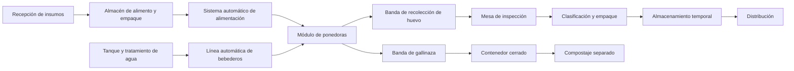

# Diseño físico preliminar

## 7.1 Módulo inicial

Se propone una nave cerrada o semicerrada de aproximadamente **18 a 24 m²**, ajustable según:

* Clima.
* Sistema de alojamiento.
* Espacio de servicio.
* Flujo de personal.
* Equipos instalados.
* Requerimientos municipales.

El módulo deberá dividirse en subgrupos, por ejemplo:

* Cuatro grupos de 25 aves.
* Cinco grupos de 20 aves.
* Seis grupos de entre 16 y 18 aves.

Esto permite:

* Aislar problemas.
* Comparar desempeño.
* Realizar mantenimiento parcial.
* Identificar consumo por subgrupo.
* Facilitar futuras pruebas de alimentación o manejo.

### Condiciones climáticas del sitio

El predio en San Francisco Acatepec se ubica en el altiplano poblano, a una altitud aproximada de 2,150 metros sobre el nivel del mar, con clima templado subhúmedo, temperaturas moderadas la mayor parte del año, noches frescas y una temporada de lluvias en verano que puede incluir granizadas. Estas condiciones deberán considerarse en el diseño:

* Menor riesgo de estrés calórico que en climas cálidos, lo que reduce la dependencia de enfriamiento evaporativo intensivo.
* Necesidad de protección contra descensos nocturnos de temperatura y heladas, particularmente en invierno.
* Estructura y techumbre resistentes a granizo.
* Buen drenaje pluvial durante la temporada de lluvias.
* Posible necesidad de calefacción auxiliar puntual, en lugar de un sistema de enfriamiento como prioridad principal.

## 7.2 Áreas generales del predio

El predio deberá considerar:

* Acceso controlado.
* Estacionamiento y recepción.
* Filtro sanitario.
* Cuarto técnico.
* Almacén de alimento.
* Área de empaque.
* Cámara o zona de almacenamiento temporal.
* Módulos de producción.
* Zona de gallinaza o compostaje.
* Área temporal para mortalidades.
* Vialidades internas.
* Espacio reservado para expansión.
* Barrera física y control de fauna.

## 7.3 Flujo operativo

---

## Navegación

- [Índice general](./README.md)
- [Documento anterior: Modelo modular de crecimiento](./06-crecimiento-modular.md)
- [Documento siguiente: Sistema de automatización](./08-automatizacion.md)
