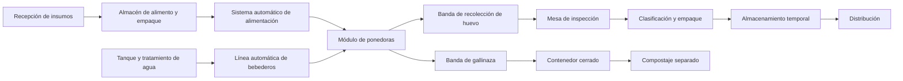

# Diseño físico preliminar

## 7.1 Módulo inicial

**Actualización (septiembre 2026):** el módulo inicial queda congelado como una **primera unidad financiable de 640 aves**. Esto no es una estimación propia: la cotización del proveedor (FamTECH — ver [registro de cotizaciones](../../evidence/quotations/README.md)) especifica textualmente "Advised chicken coop size: 17m×4m×4.2m / Total number: 640 birds" — nave de **17 × 4 × 4.2 m** (≈68 m² de huella), con jaula automatizada tipo H de **4 niveles, 5 sets** de **128 aves cada uno** (equivalencia "1 set = 1 grupo de jaula = 128 aves" confirmada por el proveedor por escrito el 2026-07-23). Esto sustituye la referencia anterior de una nave genérica de 18–24 m² con alojamiento en piso o jaula sin especificar, que correspondía a un sistema de menor densidad y ya no es una referencia válida una vez que existe una cotización real.

La subdivisión en subgrupos ya no es una decisión de diseño abierta: queda definida por la propia jaula tipo H (5 sets independientes, 4 niveles cada uno), lo que de forma natural permite:

* Aislar problemas.
* Comparar desempeño.
* Realizar mantenimiento parcial.
* Identificar consumo por subgrupo.
* Facilitar futuras pruebas de alimentación o manejo.

### Condiciones climáticas del sitio

El predio en San Francisco Acatepec se ubica en el altiplano poblano, a una altitud aproximada de 2,150 metros sobre el nivel del mar, con clima templado subhúmedo, temperaturas moderadas la mayor parte del año, noches frescas y una temporada de lluvias en verano que puede incluir granizadas. Estas condiciones deberán considerarse en el diseño:

* Menor riesgo de estrés calórico que en climas cálidos, lo que reduce la dependencia de enfriamiento evaporativo intensivo.
* Necesidad de protección contra descensos nocturnos de temperatura y heladas, particularmente en invierno.
* Estructura y techumbre resistentes a granizo.
* Buen drenaje pluvial durante la temporada de lluvias.
* Posible necesidad de calefacción auxiliar puntual, en lugar de un sistema de enfriamiento como prioridad principal.

**Nota técnica (revisión julio 2026):** la literatura de la industria (Bell & Weaver, *Commercial Chicken Meat and Egg Production*) no utiliza calefacción suplementaria para gallinas ponedoras adultas — ese recurso se reserva para la crianza de pollitas. Para clima frío en aves adultas, la estrategia estándar es **aislamiento térmico de la nave** (valores de referencia: aislante R-20 en techo y R-14 en paredes para diferencias de temperatura interior/exterior mayores a 28°C) combinado con **ventilación mínima reducida** (hasta 0.5 cfm/ave si existe sistema de enfriamiento tipo túnel para el verano), aprovechando el calor metabólico propio de las aves (~40–45 BTU/hora/ave). El clima del predio (altiplano poblano, templado subhúmedo) se ubica en la categoría media-fría de esta clasificación. En consecuencia, la calefacción auxiliar debe tratarse como **contingencia secundaria para eventos extremos**, y la prioridad de diseño debe recaer en la especificación de aislamiento térmico de techo y paredes y en el control de ventilación mínima — pendiente de solicitar al proveedor de la nave/jaula la especificación de aislamiento (valor R o equivalente) de la construcción propuesta.

### Densidad de jaula (pendiente de verificación con proveedor)

Los estándares de la industria para gallinas ponedoras en jaula (Bell & Weaver, tabla 52-2) sitúan el espacio mínimo recomendado entre **60 y 70 pulgadas² por ave (387–452 cm²)**, con un rango mundial de 48–72 in² (310–465 cm²) y el estándar europeo en 70 in² (450 cm²). La cotización vigente del proveedor (FamTECH, ver [registro de cotizaciones](../../evidence/quotations/README.md)) confirma la nave completa (17×4×4.2 m, 5 sets tipo H, 4 niveles, 640 aves) pero no incluye las dimensiones exactas de cada jaula individual (ancho, fondo y alto por nivel). NidoSmart redactó estas preguntas específicas el 2026-07-25, pero — según el hilo de correo completo revisado — no llegaron a enviarse al proveedor. **Pendiente real, aún sin resolver:** enviar al proveedor (FamTECH) las preguntas sobre dimensiones internas por jaula, espacio de comedero por ave, relación aves/níple, diseño de luminarias para 4 niveles y aislamiento térmico de la nave, para confirmar que la densidad cumple con el mínimo de 387 cm²/ave antes de confirmar la compra.

## 7.2 Áreas generales del predio

El predio deberá considerar:

* Acceso controlado.
* Estacionamiento y recepción.
* Filtro sanitario.
* Cuarto técnico.
* Almacén de alimento.
* Área de empaque.
* Cámara o zona de almacenamiento temporal.
* Módulos de producción.
* Zona de gallinaza o compostaje.
* Área temporal para mortalidades.
* Vialidades internas.
* Espacio reservado para expansión.
* Barrera física y control de fauna.

## 7.3 Flujo operativo

---

## Navegación

- [Índice general](./README.md)
- [Documento anterior: Modelo modular de crecimiento](./06-crecimiento-modular.md)
- [Documento siguiente: Sistema de automatización](./08-automatizacion.md)
