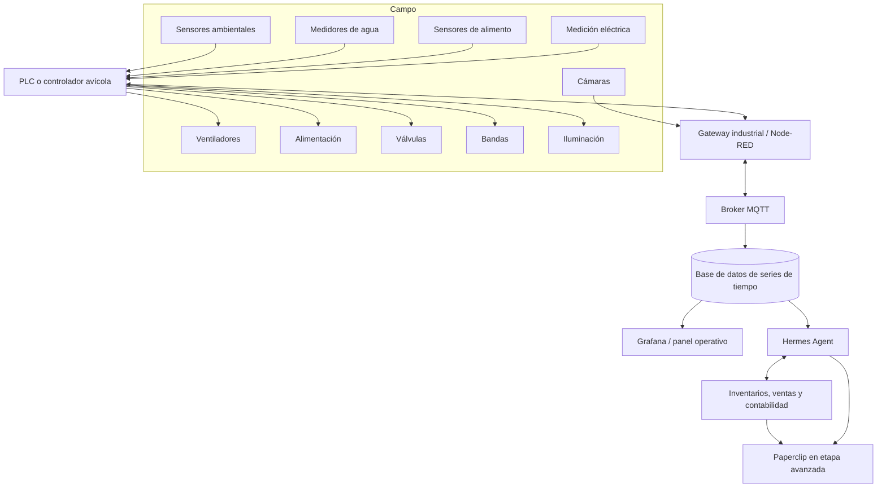

# Arquitectura tecnológica

## 10.1 Principio fundamental

El control crítico no debe depender de inteligencia artificial, servicios externos ni conexión a internet.

Este principio aplica específicamente a la capa de control físico y seguridad (agua, ventilación, alarmas), que debe operar de forma local y autónoma bajo el PLC. En cambio, la capa de datos, análisis e inteligencia (telemetría, Hermes Agent, Paperclip, monitoreo remoto) sí depende de una conexión a internet permanente, ya que la granja genera datos de forma continua para su operación asistida (véase [Conectividad a internet como requisito permanente](./09-arquitectura-electrica-hidraulica-comunicaciones.md#931-conectividad-a-internet-como-requisito-permanente)). Una falla de internet puede interrumpir el análisis, las alertas remotas y la interacción con Hermes Agent o Paperclip, pero no debe interrumpir el control físico de agua, ventilación ni alarmas.

La jerarquía será:

1. Control físico y seguridad.
2. PLC o controlador avícola.
3. Gateway e integración.
4. Base de datos y visualización.
5. Agente inteligente.
6. Sistemas administrativos.

Los niveles 1 a 3 deben poder operar sin conexión a internet. Los niveles 4 a 6 requieren conectividad a internet permanente para cumplir su función.

Esta separación entre control crítico y capa de inteligencia es una decisión estratégica registrada como [DEC-007 y DEC-008 en el registro de decisiones](./anexos/registro-de-decisiones.md).

## 10.2 Arquitectura propuesta

## 10.3 Componentes de software posibles

* Node-RED.
* Mosquitto MQTT.
* PostgreSQL.
* TimescaleDB o InfluxDB.
* Grafana.
* Home Assistant para elementos auxiliares no críticos.
* MinIO o almacenamiento equivalente para documentos.
* ERPNext, Odoo u otro ERP ligero.
* Hermes Agent.
* Paperclip en fases posteriores.

## 10.4 Nota metodológica: Precision Livestock Farming (PLF)

El diseño de monitoreo y automatización de este proyecto deberá fundamentarse en la literatura técnica y científica sobre **Precision Livestock Farming (PLF)**, y no limitarse a búsquedas bajo términos genéricos como "smart chicken coop" o "gallinero inteligente".

PLF es un campo de investigación y desarrollo tecnológico establecido que utiliza sensores, cámaras, micrófonos y software para monitorear de forma continua:

* Productividad (postura, consumo, crecimiento).
* Salud individual y de lote.
* Bienestar animal.
* Variables ambientales (temperatura, humedad, calidad del aire, ruido).

En avicultura, a diferencia de otras ramas ganaderas con identificación individual del animal, el análisis PLF suele realizarse principalmente **a nivel de lote o nave**, mediante:

* Análisis de sonido colectivo (vocalización) para detectar estrés, enfermedad o comportamiento anormal.
* Visión artificial sobre el grupo (conteo, distribución espacial, actividad, cojera) en lugar de seguimiento individual de cada ave.
* Sensores ambientales distribuidos por zona dentro de la nave.
* Correlación de variables ambientales con indicadores agregados de producción y consumo.

Esta nota deberá guiar la investigación técnica adicional, la selección de proveedores de sensores y software, y el diseño de los algoritmos de Hermes Agent, priorizando fuentes académicas y comerciales que empleen específicamente el término PLF.

## 10.5 Grafana: panel operativo

Grafana permite consultar, visualizar y generar alertas sobre métricas almacenadas en bases SQL y de series de tiempo.

Uso dentro del plan: construir el tablero operativo de la granja, integrando:

* Producción (postura diaria, huevos comercializables, huevo roto y sucio).
* Agua (consumo, presión, fugas).
* Alimento (consumo, nivel de tolva, días restantes).
* Temperatura y demás variables ambientales.
* Energía (consumo eléctrico por módulo, estado del respaldo).
* Postura (porcentaje de postura por lote, comparación contra curva esperada).
* Mantenimiento (horas de operación de equipos, alarmas, órdenes pendientes).

Grafana se conectará tanto a la base de datos de series de tiempo como a PostgreSQL, y alimentará las consultas de Hermes Agent además de la visualización directa para el operador.

---

## Navegación

- [Índice general](./README.md)
- [Documento anterior: Arquitectura eléctrica, hidráulica y de comunicaciones](./09-arquitectura-electrica-hidraulica-comunicaciones.md)
- [Documento siguiente: Evaluación técnica de Hermes Agent y Paperclip](./11-hermes-agent-y-paperclip.md)
